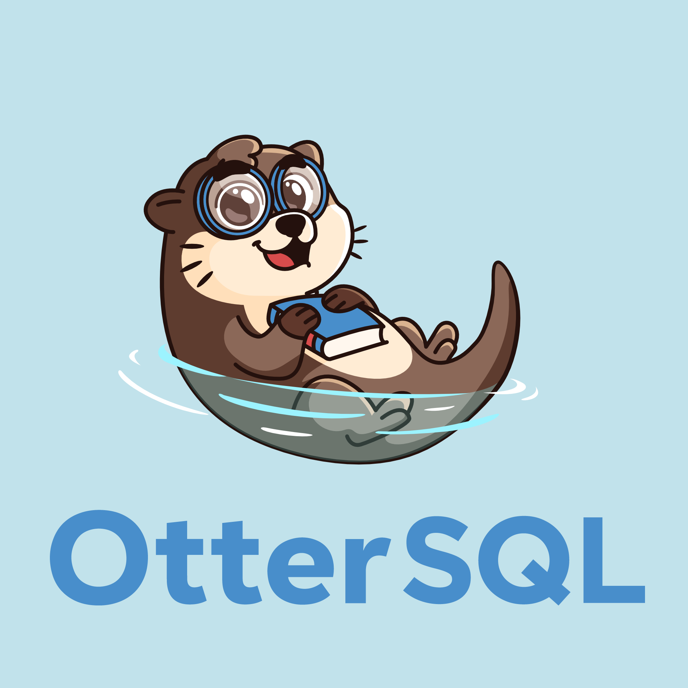

  <!-- https://raw.githubusercontent.com/SeaQL/otter-sql/main -->
  

  <h1>OtterSql</h1>

  <h3>An embeddable SQL executor</h3>

  
  
  

OtterSql implements a generic intermediate code (IC) with an **instruction set** for tabular data operations. This IC can be used to make in-memory mocks of larger databases such as MySQL and PostgreSQL. This IC is executed by the **OtterSql VM**. This project also provides a frontend that compiles a generic dialect of SQL to the IC.

The primary goal for this project is to facilitate developers in *testing* their SQL-backed applications.

Non-goals (for now): performance, concurrency, persistence, ACID compliance.

## FAQ

See [this blog post](#) introducing OtterSql.

## Use as a library

See [**the crate documentation**](https://docs.rs/otter-sql/latest).

## Features

### Currently implemented

- [x] `CREATE TABLE`/`CREATE SCHEMA`
- [x] `INSERT` values
- [x] Projection (`SELECT`ing specific columns)
- [x] Filter (`WHERE` clause of `SELECT`) with complex expressions
- [x] `LIMIT`
- [x] `ORDER BY`

### In-progress or in the near future

- [ ] `UPDATE`: execution
- [ ] Unions and Joins: execution
- [ ] Group by: execution
- [ ] Nested `SELECT`: codegen and execution
- [ ] Common table expressions (CTEs): codegen and execution
- [ ] Uphold table constraints: codegen and execution

### In the far future

- [ ] MySQL support
- [ ] PostgreSQL support

## Mascot

Meet the official mascot of OtterSql. He is a book worm.

